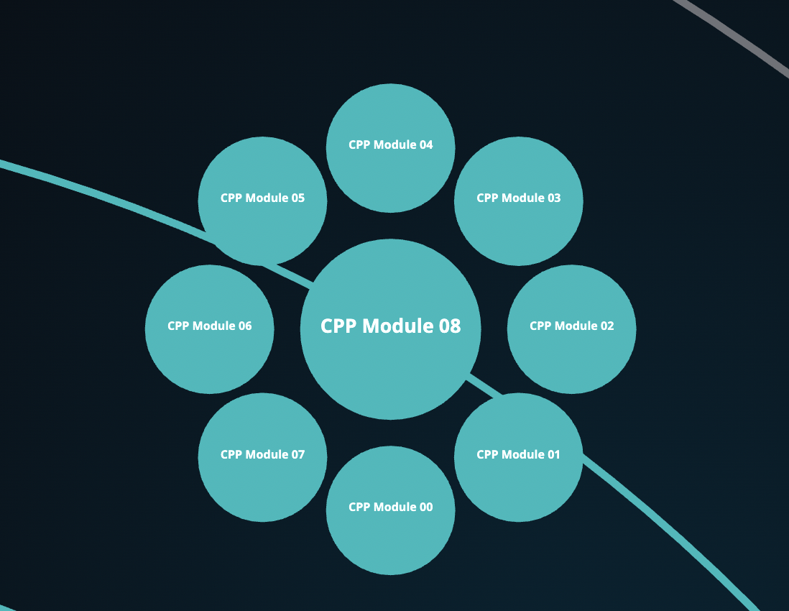

# cpp_modules

Intruduction in С++

Introduction in OOP

## Modules

- module00 - Namespaces, classes, member functions, stdio streams, initialization lists, static, const, and some other basic stuf
- module01 - Memory allocation, pointers to members, references, switch statement
- module02 - Ad-hoc polymorphism, operator overloading and Orthodox Canonical class form
- module03 - Inheritance
- module04 - Subtype polymorphism, abstract classes, interfaces
- module05 - Repetition and Exceptions
- module06 - C++ casts
- module07 - C++ templates
- module08 - Templated containers, iterators, algorithms

## Launch

1. Build a project using Makefile

   ```sh
   $ make
   ```

2. Run test script

   ```sh
   $ make test
   ```

## Done

  
